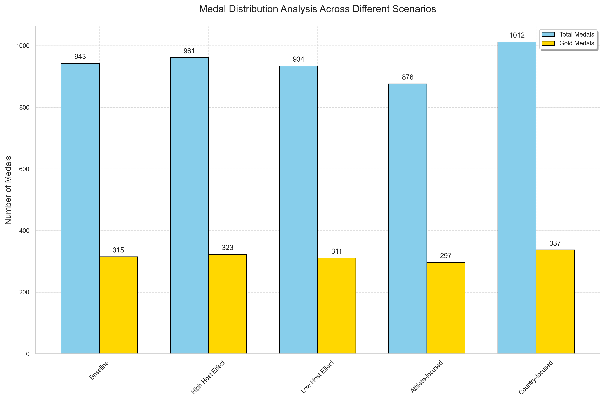
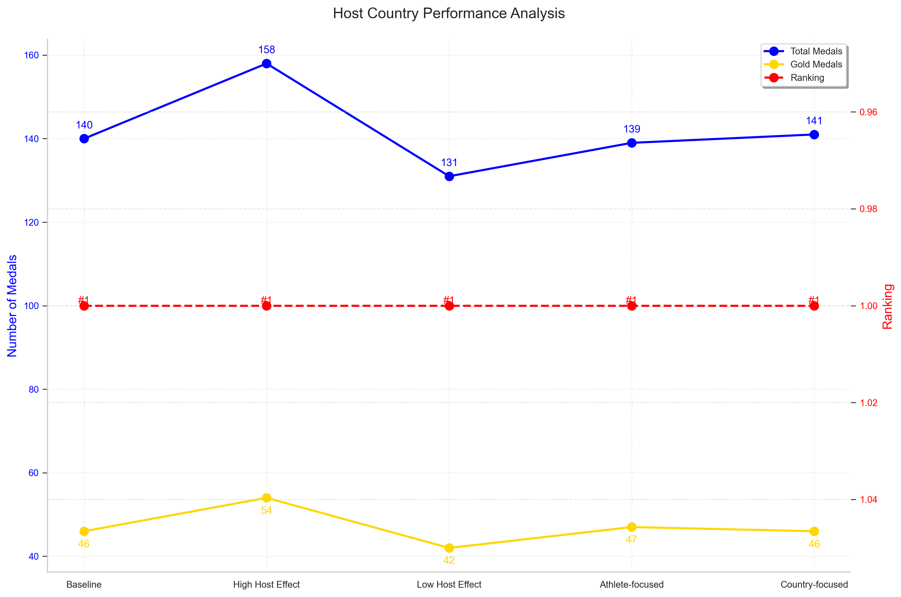
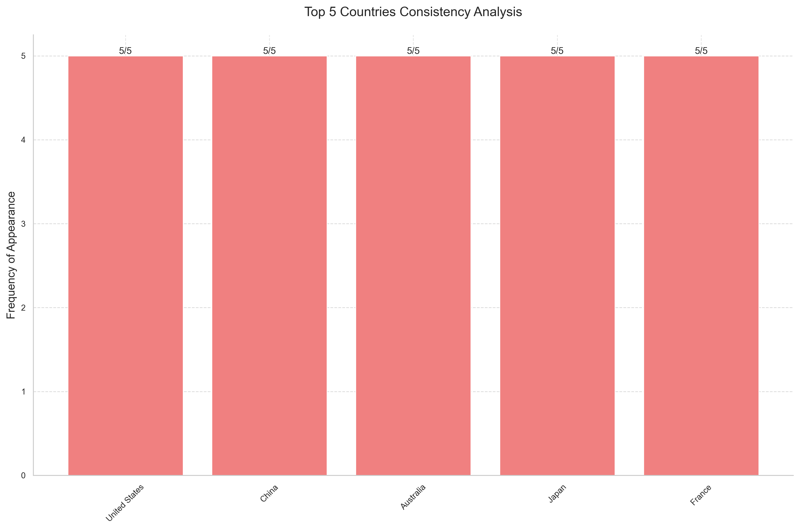
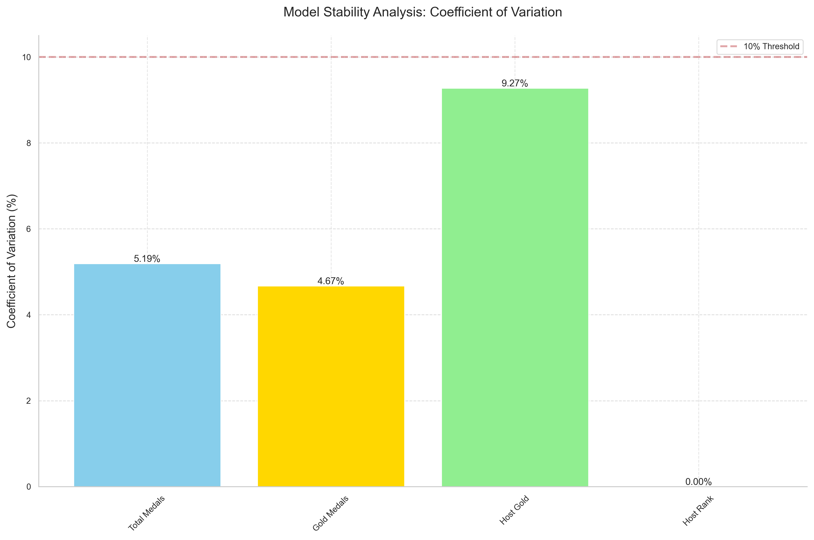

# 🏅 Olympic Medal Prediction Model | 奥运会奖牌预测模型

<div align="center">
  


**MCM/ICM 2025 Problem C Solution | 美国大学生数学建模竞赛2025年C题解决方案**

**🏆 Meritorious Winner (M奖) 🏆**

[](https://github.com/yourusername/olympic-medal-prediction/stargazers/)
[](LICENSE)
[](https://www.comap.com/contests/mcm-icm)
[](https://www.python.org/)
[](https://pandas.pydata.org/)
[](https://numpy.org/)

</div>

## 📌 项目概述 | Project Overview

[English](#english-version) | [中文](#chinese-version)

---

<a id="english-version"></a>
## 🌍 English Version

### 📊 Project Description

This repository contains our solution for Problem C of the 2025 Mathematical Contest in Modeling (MCM/ICM), which was awarded the **Meritorious Winner (M Prize)** distinction. We developed a predictive model for Olympic medal counts using time series analysis and the Grey Model (GM(1,1)).

Our solution analyzes historical Olympic data from 1896 to 2024, including athlete performance, medal distributions, and host country advantages, to forecast medal outcomes for future Olympic Games.

### 🏆 Award

Our team received the **Meritorious Winner (M Prize)** award in the 2025 Mathematical Contest in Modeling (MCM/ICM), placing our paper in the top 8% of all submissions worldwide.

### 🔍 Key Features

- **Grey Prediction Model (GM(1,1))**: Implements time series forecasting techniques to predict athlete performance and medal counts
- **Comprehensive Data Analysis**: Examines historical Olympic data across multiple dimensions
- **Host Country Performance Analysis**: Evaluates the impact of hosting the Olympics on medal outcomes
- **Medal Allocation Algorithm**: Creates a fair system for distributing medals based on predicted performance scores

### 📋 Repository Contents

- `2025_Problem_C_Data/`: Original competition dataset
  - `summerOly_athletes.csv`: Athlete participation data
  - `summerOly_medal_counts.csv`: Historical medal counts by country
  - `summerOly_hosts.csv`: Olympic host cities and countries
  - `summerOly_programs.csv`: Olympic sports and events data
  - `data_dictionary.csv`: Descriptions of all data fields
- `gray.py`: Implementation of the Grey Model (GM(1,1)) and prediction algorithms
- `figures/`: Visualizations of model results and analysis
- `2025_MCM_Problem_C.pdf`: Original problem statement

### 🚀 How to Use

1. Clone this repository
2. Install the required dependencies:
   ```
   pip install pandas numpy matplotlib seaborn
   ```
3. Run the Grey prediction model:
   ```
   python gray.py
   ```

---

<a id="chinese-version"></a>
## 🌏 中文版本

### 📊 项目描述

本仓库包含我们针对2025年美国大学生数学建模竞赛(MCM/ICM)C题的解决方案，该方案荣获**M奖（Meritorious Winner）**。我们开发了一个基于时间序列分析和灰色预测模型(GM(1,1))的奥运会奖牌预测模型。

我们的解决方案分析了从1896年到2024年的奥运会历史数据，包括运动员表现、奖牌分布以及主办国优势，以预测未来奥运会的奖牌结果。

### 🏆 获奖情况

我们团队在2025年美国大学生数学建模竞赛(MCM/ICM)中荣获**M奖（Meritorious Winner）**，该奖项代表我们的论文在全球所有参赛作品中排名前8%。

### 🔍 主要特点

- **灰色预测模型(GM(1,1))**: 实现时间序列预测技术，预测运动员表现和奖牌数量
- **全面的数据分析**: 从多个维度检验奥运会历史数据
- **主办国表现分析**: 评估举办奥运会对主办国奖牌成绩的影响
- **奖牌分配算法**: 基于预测的表现分数，创建公平的奖牌分配系统

### 📋 仓库内容

- `2025_Problem_C_Data/`: 原始比赛数据集
  - `summerOly_athletes.csv`: 运动员参赛数据
  - `summerOly_medal_counts.csv`: 各国历史奖牌数统计
  - `summerOly_hosts.csv`: 奥运会主办城市和国家
  - `summerOly_programs.csv`: 奥运会项目和赛事数据
  - `data_dictionary.csv`: 所有数据字段的说明
- `gray.py`: 灰色预测模型(GM(1,1))和预测算法的实现
- `figures/`: 模型结果和分析的可视化
- `2025_MCM_Problem_C.pdf`: 原始问题陈述

### 🚀 使用方法

1. 克隆本仓库
2. 安装所需依赖:
   ```
   pip install pandas numpy matplotlib seaborn
   ```
3. 运行灰色预测模型:
   ```
   python gray.py
   ```

---

## 📊 结果展示 | Result Visualization

<div align="center">
  
  
</div>

<div align="center">
  
  
</div>

## 📝 联系方式 | Contact Information

如果您对美国数学建模竞赛(MCM/ICM)有任何疑问，或者想要了解更多关于我们模型的信息，请在GitHub上给本项目点Star⭐，我将私底下回复您的问题。

If you have any questions about the Mathematical Contest in Modeling (MCM/ICM), or want to learn more about our model, please star⭐ this project on GitHub, and I will respond to your questions privately.

## 📄 许可证 | License

本项目采用MIT许可证 - 查看[LICENSE](LICENSE)文件了解详情

This project is licensed under the MIT License - see the [LICENSE](LICENSE) file for details. 